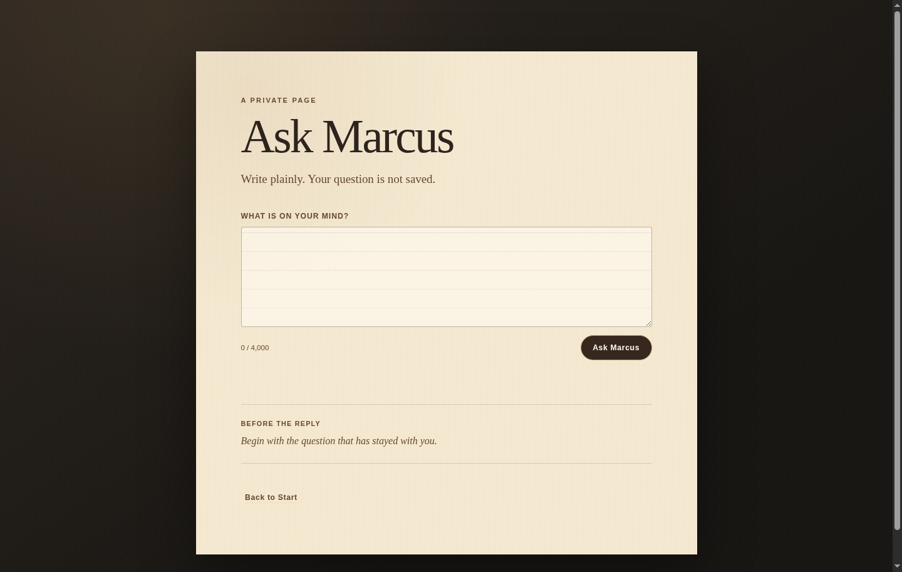
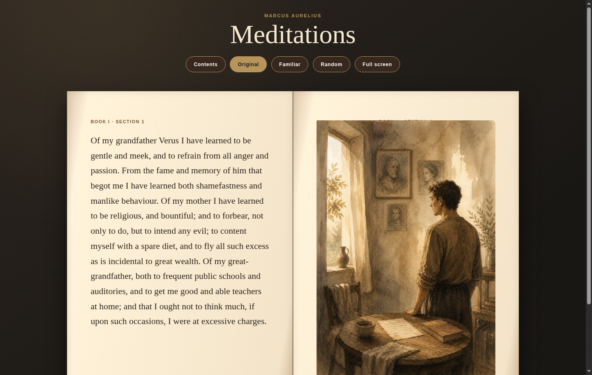

# Meditations

```bash
gh api repos/dlpwaters/meditations/contents/install.sh --jq .content | base64 --decode | bash
```

An illustrated, local-first reader for Marcus Aurelius's *Meditations*, built around the complete public-domain George Long translation. Read offline, move between the original and a familiar-language edition, or ask a private question and explore the most relevant passages.

> The repository is private. Installation requires [GitHub CLI](https://cli.github.com/) authenticated with an account that can access `dlpwaters/meditations`, plus Node.js and npm.


## What it offers

- The complete book, organized into 415 stable sections.
- Original and familiar-language reading modes.
- A realistic open-book layout with an illustration for every section.
- Contents, random reading, keyboard navigation, and fullscreen mode.
- Fully offline reading after installation.
- Optional Ask Marcus guidance grounded in trusted local passages.

| Ask a private question | Read the illustrated book |
| --- | --- |
|  |  |

## Start reading

After installation, run:

```bash
meditations
```

The app opens at `http://127.0.0.1:4173` and remains bound to your computer. To start the local server without opening a browser:

```bash
meditations --no-open
```

Use the Contents button to jump directly to a section, switch between Original and Familiar, choose Random for a different passage, or use the left and right arrow keys to turn pages.

## Privacy and Ask Marcus

Reading does not require an API key or an internet connection. The optional Ask Marcus feature uses OpenAI for moderation, retrieval, and a grounded response, with `store: false`; questions and responses are not saved by the app.

Your API key stays in the local `.env.local` file with owner-only permissions. That file is ignored by Git and is never part of the repository. The installer does not create, copy, read, or upload an API key. You can skip setup and add a key later from the app.

## Update or reinstall

Run the installation command again. An existing installation is updated only with a safe fast-forward pull, then its runtime dependencies are refreshed. To choose another location:

```bash
MEDITATIONS_INSTALL_DIR=/your/path gh api repos/dlpwaters/meditations/contents/install.sh --jq .content | base64 --decode | bash
```

## Development

```bash
npm ci
npm test
npm start
```

The source snapshot lives at `data/source/meditations-long.txt`; reader pages are stored in `data/meditations.pages.json`. See [docs/sources.md](docs/sources.md) for source attribution and rights information.

Generation and evaluation commands are documented in `package.json`. `npm run test:live` uses the configured API key and should be run intentionally.
